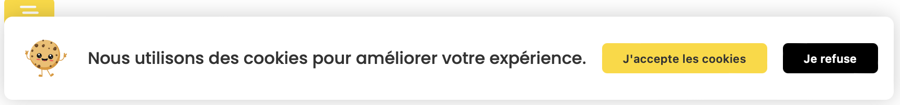

# Cookies-PopUp

Ce projet est une simple implémentation d'un popup d'acceptation de cookies. L'utilisateur est informé que le site utilise des cookies et peut choisir d'accepter ou de refuser. Le choix de l'utilisateur est mémorisé pour les visites futures à l'aide de `localStorage`.

## Fonctionnalités

- Popup stylisé informant l'utilisateur de l'utilisation de cookies.
- Boutons pour accepter ou refuser les cookies.
- Mémorisation du choix de l'utilisateur pour ne pas afficher le popup lors des visites suivantes.
- Bouton pour réafficher le popup et permettre à l'utilisateur de revoir sa décision.



## Comment ça marche ?

Lors de la première visite de l'utilisateur, un popup s'affiche lui demandant s'il accepte ou refuse l'utilisation de cookies. Une fois qu'un choix est fait, il est sauvegardé dans le `localStorage` du navigateur, ce qui signifie que le popup ne s'affichera pas lors des visites ultérieures.

Si l'utilisateur souhaite revoir sa décision, il peut utiliser le bouton "Réouvrir la popup" pour afficher à nouveau le popup.

Pour rénitialiser les cookies, entrer cette commande dans la console du navigateur ```localStorage.removeItem('cookiesDecision');```


## Installation

1. Clonez ce dépôt.
2. Ouvrez `index.html` dans votre navigateur.
3. Pour voir à nouveau le popup après avoir fait un choix, supprimez l'élément `cookiesDecision` du `localStorage` ou utilisez le bouton "Réouvrir la popup".

## Personnalisation

- Modifier le disign de la popup
- Modifier l'animation de la popup

## Contributions

Les contributions sont les bienvenues ! N'hésitez pas à ouvrir une issue ou à soumettre une pull request.